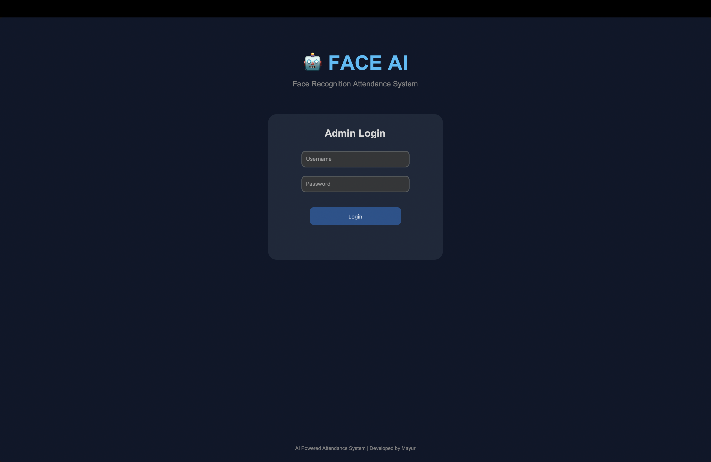

# 🎓 AI Face Recognition Attendance System

An **AI-powered attendance management system** that automatically marks student attendance using **Face Recognition technology**.

This system captures student face images, recognizes them using **DeepFace (Deep Learning)**, and records attendance automatically in an **Excel sheet**.

---

# 🚀 Project Overview

Traditional attendance systems are time-consuming and prone to errors.
This project provides a **smart automated attendance system** using **computer vision and deep learning**.

The system detects and recognizes student faces through a webcam and automatically marks attendance in real time.

---

# ✨ Features

* 🔐 Secure Admin Login System
* 📸 Student Face Dataset Capture
* 🧠 Face Recognition using DeepFace
* 📊 Automatic Attendance Recording in Excel
* ⏱ Live Date & Time on Dashboard
* 📈 Attendance Statistics Counter
* 🖥 Modern GUI using CustomTkinter
* 🚫 Duplicate Attendance Prevention

---

# 🛠 Technologies Used

| Technology    | Purpose                   |
| ------------- | ------------------------- |
| Python        | Core programming language |
| OpenCV        | Face detection            |
| DeepFace      | Face recognition          |
| CustomTkinter | GUI development           |
| OpenPyXL      | Excel attendance storage  |
| Git & GitHub  | Version control           |

---

# 📂 Project Structure

```id="tree01"
AI-Face-Attendance-System
│
├── login.py
├── main.py
├── dataset_capture.py
├── face_recognition.py
├── attendance.py
├── haarcascade_frontalface_default.xml
├── requirements.txt
│
├── screenshots
│
└── README.md
```

---

# 📸 Screenshots

## 🔐 Login Page



## 🖥 Dashboard


## 🧠 Face Recognition


## 📊 Attendance Excel


---

# ⚙ Installation

### 1️⃣ Clone Repository

```id="cmdclone"
git clone https://github.com/Mayur-ghuge/AI-Face-Attendance-System.git
cd AI-Face-Attendance-System
```

### 2️⃣ Create Virtual Environment

```id="cmdvenv"
python3 -m venv venv
source venv/bin/activate
```

### 3️⃣ Install Dependencies

```id="cmdinstall"
pip install -r requirements.txt
```

---

# ▶ Run the Application

```id="cmdrun"
python login.py
```

Login Credentials

```
Username: admin
Password: 1234
```

---

# 🧠 System Workflow

1️⃣ Capture student face dataset
2️⃣ Store face images in dataset folder
3️⃣ Detect face using OpenCV Haar Cascade
4️⃣ Recognize face using DeepFace
5️⃣ Automatically record attendance in Excel

---

# 📊 Attendance Output

Attendance is stored in:

```
attendance.xlsx
```

Example:

| Name  | Date       | Time     | Status  |
| ----- | ---------- | -------- | ------- |
| Mayur | 10/03/2026 | 10:25:14 | Present |

---

# 🔮 Future Improvements

* Cloud Database Integration
* Mobile Application Integration
* Real-time Analytics Dashboard
* Multiple Face Recognition
* Mask Detection Support

---

# 👨‍💻 Author

**Mayur Ghuge**

GitHub
https://github.com/Mayur-ghuge

---

⭐ If you like this project, consider giving it a star on GitHub!
